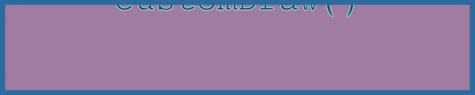

# Canvas Text Animator JavaScript (ctajs)

**A mini library for drawing basic text animations to the HTML `<canvas>`**
</br>

## **_Basic Features:_**

- _Create multiple scenes_
- _Each scene can contain multiple text animations, a user defined background colour, zoom factor and duration_
- _Each word can have a custom defined start position, end position, font size, fill colour and duration_
  </br>

## **_Usage:_**

1. Create canvas element in your html document
   ```html
   <canvas id="ctajs-canvas"></canvas>
   ```
1. Connect JavaScript to your HTML using one of the following methods
   - **_jsDelivr_**
   ```html
   <script src="https://cdn.jsdelivr.net/gh/marcobuontempo/canvas-text-animator@latest/cta-library.js"></script>
   ```
   - **_jsDelivr - Minified Version_**
   ```html
   <script src="https://cdn.jsdelivr.net/gh/marcobuontempo/canvas-text-animator@latest/cta-library.min.js"></script>
   ```
   - **_Relative File (requires download of .js file from GitHub)_**
   ```html
   <script src="cta-library.js"></script>
   ```
1. Initialise animation object

   ```js
   const ctaOptions = {
     height: 200,                 //height of canvas (px)
     width: 1000,                 //height of canvas (px)
     domID: "ctajs-canvas",       //DOM id that you assigned to your `<canvas>` element
     customDraw: undefined        //a callback function for custom canvas draws (more detail can be found on this further below)
   };

   const ctaJS = new CanvasTextAnimation(ctaOptions);
   ```

1. Create word objects to use in each scene _(refer to .js file for information about each parameter. Most 'drawing' parameters actually refer to the [default styles and colours with HTML canvas](https://developer.mozilla.org/en-US/docs/Web/API/Canvas_API/Tutorial/Applying_styles_and_colors))_

   ```js
   const wordOptions = {
     text: "ctaJS",               //actual string of text to draw onto canvas
     font: "Brush Script MT",     //font style to use
     fontSize: 72,                //font size (px)
     fillColour: "#3F826D",       //hexadecimal colour code for the text in-fill
     lineColour: "#545E75",       //hexadecimal colour code for the text outline
     lineWidth: 2,                //thickness of the text
     xInitial: ctaJS.WIDTH / 2,   //starting x-axis position of the drawn text (px)
     yInitial: 0,                 //starting y-axis position of the drawn text (px)
     xEnd: ctaJS.WIDTH / 2,       //ending x-axis position of the drawn text (px)
     yEnd: ctaJS.HEIGHT / 2,      //starting y-axis position of the drawn text (px)
     duration: 5000,              //duration of the text's animation (ms)
     drawOnCompletion: true,      //whether to continue rendering text in scene after its duration has elapsed (boolean)
     sceneNumber: 1,              //assign it to the scene number you want to draw in
   };

   ctaJS.createWord(wordOptions);
   ```

1. Create scene _(refer to .js file for information about each parameter)_

   ```js
   const sceneOptions = {
     duration: 5000,                //duration of the entire scene's animation (ms)
     zoom: 1.1,                     //a linear zoom factor
     backgroundColour: "#F2D0A4",   //hexadecimal colour code for the scene's background
   };

   ctaJS.setSceneOptions(1, sceneOptions);  //first argument is the scene number to create (in this example, scene #1)
   ```

1. Repeat steps 4 & 5 for your required words and scenes
1. Animate all scenes!
   ```js
   ctaJS.animateAll()
   ```
   </br>

### **Additional Usage:**

- It is possible to add additional custom draws to the canvas (e.g. shapes, lines, etc.).
- Simply pass a custom function in the ctaOptions object when intialising the ctaJS class:
```js
        const ctaOptions = {
            height: 200,
            width: 1000,
            domID: "ctajs-canvas",
            customDraw: function customDraw(ctx, timestamp, timeElapsed, starttime, sceneObj) {
                ctx.save();     //save the current settings/state of canvas before custom draw
                
                /* Add custom draws here */
                
                ctx.restore();  //restore the saved settings/state of canvas after custom draws are completed
            }
        };
```
- A demo of a custom draw can be found in the examples below.
- *NOTE: your custom function should take the same parameters as above (i.e. `ctx`, `timestamp`, `timeElapsed`, `starttime`, `scenObj`). Please refer to the invocation of `this.customDraw()` in cta-library.js to understand how these parameters are passed.*
- *NOTE: `use ctx.save();` and `ctx.restore();` at the start and end of your function, respectively, to prevent unexpected behaviour with the canvas.*

## **_Examples:_**

_Note: the preview images below have a **significant** reduction in quality and animation compared to the actual web rendering_</br>
**Click a demo below to check out the codepen and actual rendering!**

- ### [**Demo 1** _(as per the usage example above)_](https://codepen.io/marcobuontempo/pen/vYjxpLd)

<a href="https://codepen.io/marcobuontempo/pen/vYjxpLd">
    
</a>

- ### [**Demo 2**](https://codepen.io/marcobuontempo/pen/RwypQrm)

<a href="https://codepen.io/marcobuontempo/pen/RwypQrm">
    
</a>

- ### [**Demo 3**](https://codepen.io/marcobuontempo/pen/JjvWLMd)
<a href="https://codepen.io/marcobuontempo/pen/JjvWLMd">
    
</a>

- ### [**Demo 4** _(showcasing a basic customDraw() function to add a rectangle to canvas)_](https://codepen.io/marcobuontempo/pen/eYrPxWm)
<a href="https://codepen.io/marcobuontempo/pen/eYrPxWm">
    
</a>
</br>

## **_Support:_**

This was just a small hobby project to allow easier writing to the html canvas. Not sure if anything further will be added at this stage. However, feel free to contact me for any assistance, issues, requests, etc! Or feel free to contribute :)
</br>

## **_Licence:_**

[MIT](LICENSE)
